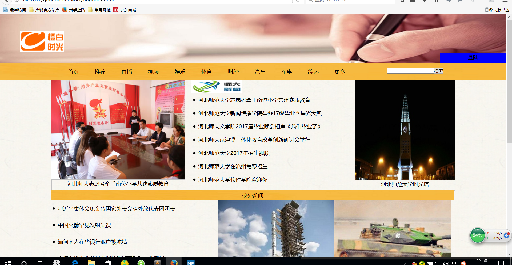
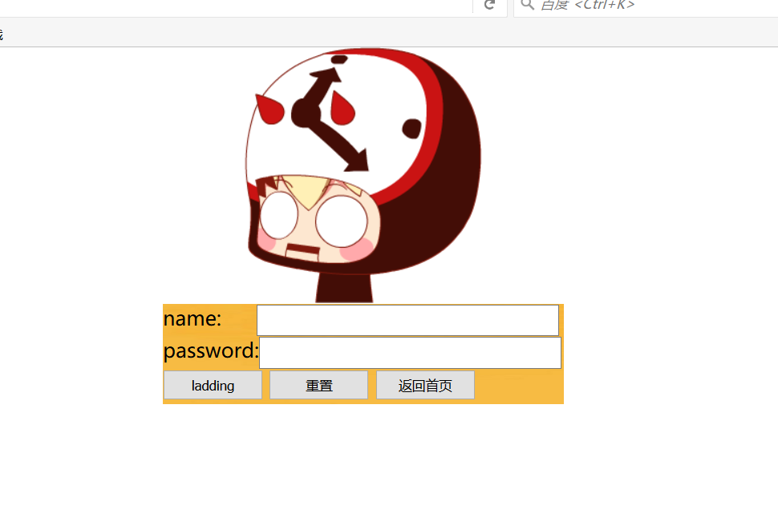
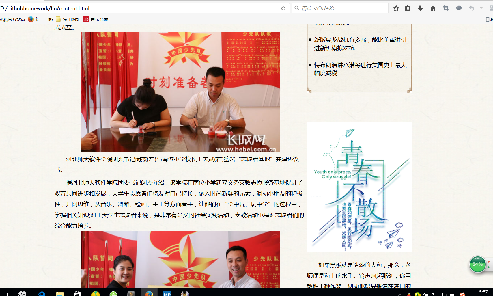
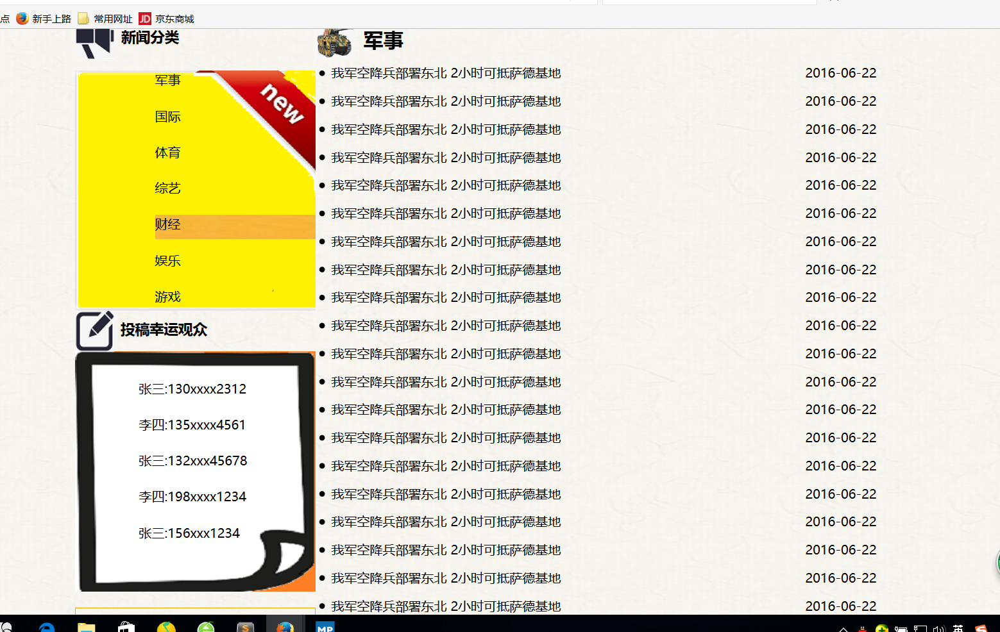
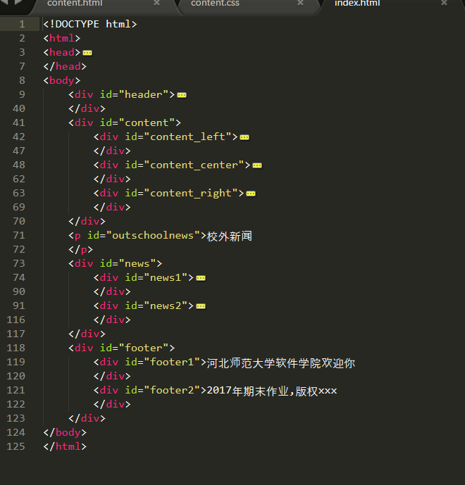
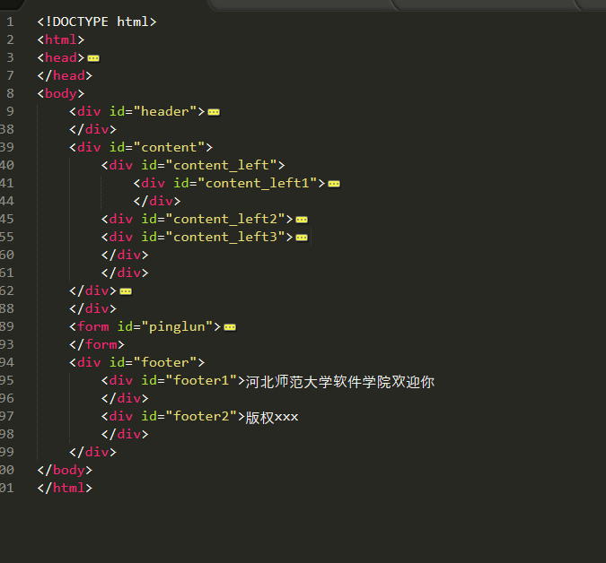
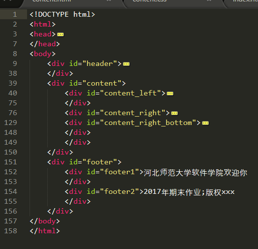
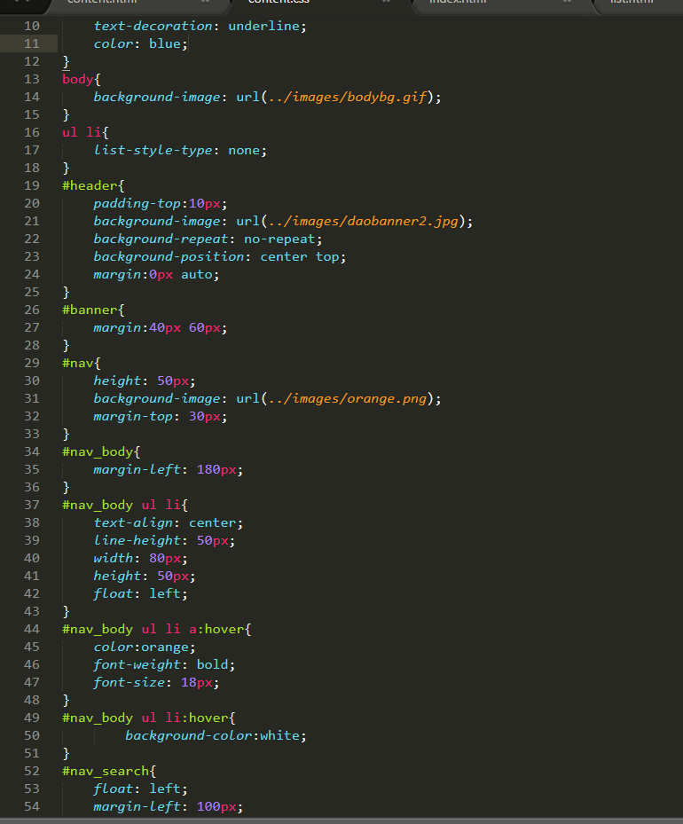
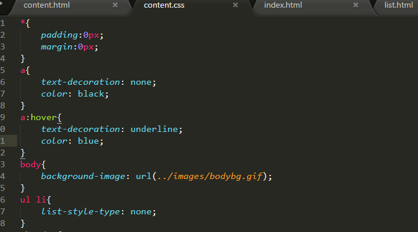

#【课程设计名称】
##设计目的

1熟练掌握html在组织结构上的优势

2熟练掌握css在网页布局中的应用

3学习web标准及浏览器的兼容性

##设计步骤
###1功能性需求分析

该网站共有4页页面，其中每一个页面的屏幕截图及主要功能如下所列

功能：此网页为首页，用户在此页面可以登录。也有很多新闻的专题可供选择

导航栏功能：将新闻分为几个模块，更好的为用户服务

功能：此界面为登录界面，用户登录时会转到此界面

功能：此界面为用户选择的新闻的全文

功能：此界面为新闻的列表页，还有一些幸运观众的获奖名单

###2手机网站素材
###3建立网站代码目录结构

###4编写html代码
（1）首页部分：

整体结构分为三个盒子导航栏，中间一部分，还有页脚

核心代码：

###5编写css布局及样式

(1)css布局：

(2)添加css样式

###6调试浏览器兼容性

没有问题，要在css中统一设计就好

###问题记录

###设计总结
1 需求分析阶段的经验：我们大学生不能只是知道学习，一些国家大事也要经常关注，写这个网页就是为了让大学生能够及时关注一些自己感兴趣的新闻

2编写html代码的经验：写一个标签的时候要先将结构写出来在往里面添加内容，双标签先把两个标签啊写出来，单标签的话就出来'\'在写代码的时候，要先规划好结构，将网页的结构给编写出来。

3css布局的经验：用好盒子模型，盒子套盒子，根据自己想要的页面来安排盒子的摆放。

4设置css样式经验：编写css代码的时候，要先设置一些通用属性，防止不同的浏览器产生不同的效果，然后在根据自己的需求，合理的编写css。

5调整浏览器兼容性经验：可以在css里面设计相关的属性
例如

*{margin：0px;padding:0px;}

body{text-align:center;}

###课程小结

1 html内容()
 
html是用来描述网页的一种语言：超文本标记语言。

2 css内容

css指的是层叠样式表，用来解决内容与表现分离的问题。可以极大的提高工作效率

3 网上参考的内容

长城网的一些新闻图片和文章；还有从网上设计的网页，一些图片也是从网页上面下载的

4 浏览器对css的兼容性上的不同表现()：

IE浏览器不会使页面居中

###解决方案

设置body{text-align=center}或者设置左右外边距为auto即可;